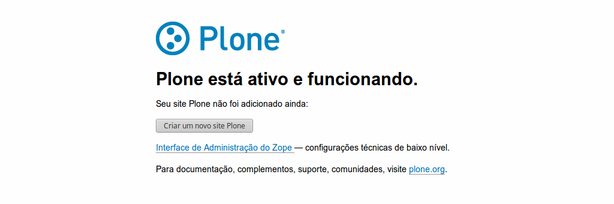
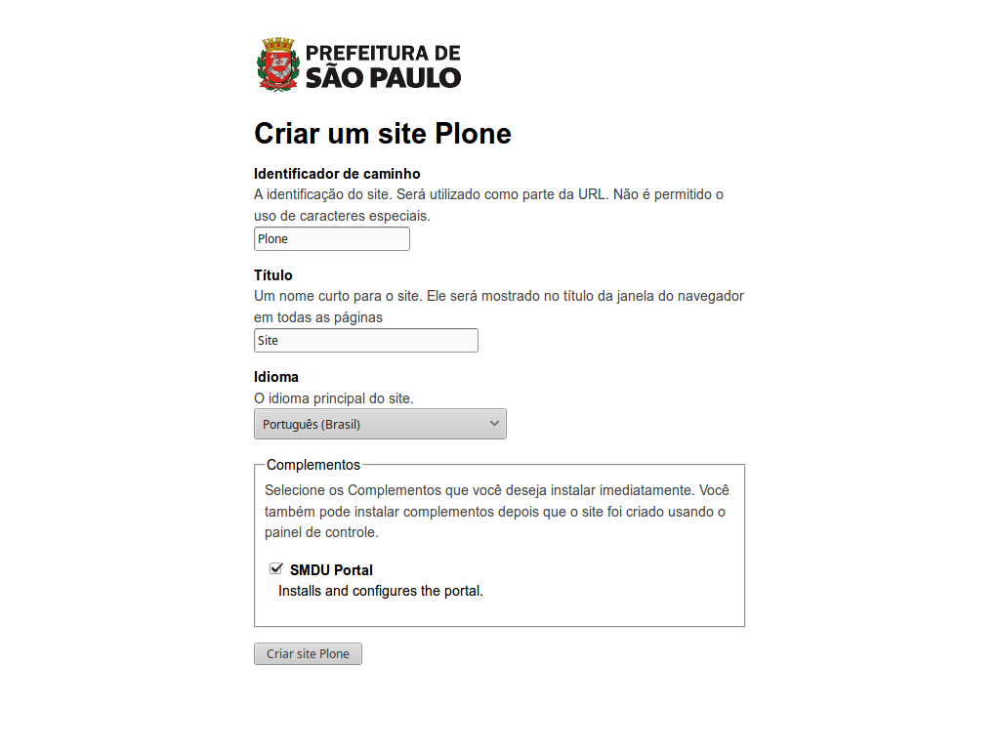
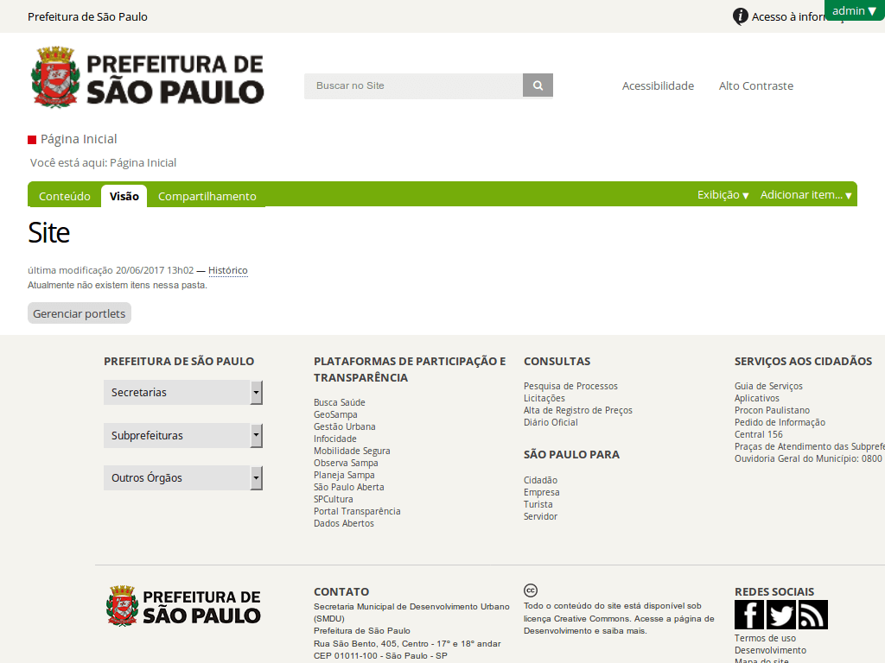

***********
SMDU Portal
***********

.. contents:: Conteúdos
   :depth: 2

Introdução
==========

.. image:: https://img.shields.io/travis/hvelarde/smdu.portal/master.svg
    :target: http://travis-ci.org/hvelarde/smdu.portal

.. image:: https://img.shields.io/coveralls/hvelarde/smdu.portal/master.svg
    :target: https://coveralls.io/r/hvelarde/smdu.portal

TBD

Instalação
==========

A instalação da plataforma requere de uma série de pré-requisitos de software e hardware que devem ser satisfeitos.

Hardware e software
-------------------

Para portais pequenos (milhares de visitantes por dia),
a sugestão é utilizar servidores com pelo menos 1 processador e 1GB de memória RAM;
o espaço em disco depende da quantidade de conteúdo armazenada no portal e,
como sugestão,
nunca deve ser menor a 3 vezes o tamanho do banco de dados e o blobstorage somados,
para evitar problemas após backups.

Para portais maiores (dezenas de milhares de visitantes por dia ou mais),
a sugestão é utilizar servidores com múltiplos processadores y memória RAM suficiente para rodar o acelerador web Varnish 5.

O sistema operacional recomendado é Ubuntu Server 16.04.1 LTS,
mas a plataforma pode rodar também em servidores que utilizem diferentes versões do CentOS.

Outros pré-requisitos
---------------------

Se recomenda sempre atualizar os pacotes do sistema operacional antes de instalar as dependências.

Instalação no Ubuntu Server 16.04.2 LTS
^^^^^^^^^^^^^^^^^^^^^^^^^^^^^^^^^^^^^^^

.. code-block:: console

    sudo apt update && sudo apt upgrade
    sudo apt install -y build-essential libssl-dev libxml2-dev libxslt1-dev libbz2-dev zlib1g-dev python-setuptools python-dev python-virtualenv libjpeg62-dev libreadline-gplv2-dev python-imaging python-pip wv poppler-utils git libldap2-dev libsasl2-dev libssl-dev

Instalação no CentOS 7
^^^^^^^^^^^^^^^^^^^^^^

.. code-block:: console

    sudo yum install -y epel-release && sudo yum update -y
    sudo yum install -y gcc gcc-g++ make tar bzip2 gzip openssl-devel libxml2-devel libxml2 libxslt-devel bzip2-libs zlib-devel python-setuptools python-devel python-virtualenv libjpeg-turbo-devel readline-devel python-imaging python-pip poppler-utils git openldap-devel
    sudo yum install -y http://repo.iotti.biz/CentOS/7/x86_64/wv-1.2.9-10.el7.lux.x86_64.rpm

Criação de usuário
^^^^^^^^^^^^^^^^^^

O Zope nunca deve rodar usando o usuário root;
é necessária a criação de um usuário especial para esse fim:

.. code-block:: console

    sudo useradd --system --shell /bin/bash --user-group -m --home-dir /opt/plone plone
    sudo passwd plone
    sudo su - plone

Instalação do ambiente virtual
^^^^^^^^^^^^^^^^^^^^^^^^^^^^^^

O Python do sistema operacional nunca deve ser utilizado para rodar o Zope,
pois pode gerar problemas produzidos por versões de dependências conflitantes.
A recomendação é sempre instalar e ativar um ambiente virtual utilizando o seguinte comando na home do usuário criado no item anterior:

.. code-block:: console

    virtualenv py27
    source py27/bin/activate

Descarga do código fonte do portal
^^^^^^^^^^^^^^^^^^^^^^^^^^^^^^^^^^

A instalação recomendada utiliza o código fonte da plataforma descarregado direitamente do repositório utilizando o sistema de controle de versões Git.
O repositório principal inclui submódulos que devem ser também inicializados:

.. code-block:: console

    git clone https://github.com/hvelarde/smdu.portal.git
    cd smdu.portal
    git submodule init
    git submodule update

Compilação do Zope
------------------

A plataforma utiliza a ferramenta `Buildout <http://www.buildout.org/>` para gerenciar os componentes do projeto.
O código fonte não inclui uma configuração por padrão (``buildout.cfg``) mas duas configurações para ser usadas em desenvolvimento (``development.cfg``) ou produção (``production.cfg``).
Antes de dar bootstrap no projeto precisamos definir qual de essas configurações utilizaremos:
Para ambientes de desenvolvimento a sugestão é usar:

.. code-block:: console

    ln -s development.cfg buildout.cfg

Já em ambientes de produção devemos utilizar:

.. code-block:: console

    ln -s production.cfg buildout.cfg

Para compilar o Zope é necessário dar um bootstrap no projeto e rodar o buildout:

.. code-block:: console

    python bootstrap.py
    bin/buildout

Inicialização do Zope
^^^^^^^^^^^^^^^^^^^^^

A configuração de desenvolvimento inclui uma instância única de Zope;
a configuração de produção, por sua vez, inclui duas instâncias rodando em modo ZEO client e um ZEO server.
Dependendo da configuração utilizada o Zope deverá que ser inicializado de diferente forma.
Em ambientes de desenvolvimento devemos utilizar:

.. code-block:: console

    bin/instance fg

Já em ambientes de produção o buildout inclui a inicialização automática dos componentes do projeto utilizando o `Supervisor <http://supervisord.org/>`_:

.. code-block:: console

    bin/supervisord
    bin/supervisorctl status

Criação de um portal
====================

Após iniciar a instância de Zope será preciso criar um novo portal no servidor.
Ao visitar o endereço da instância 8 observaremos a tela de criação do novo portal.

.. note::
    Em ambientes de desenvolvimento a instância roda na porta 8080 do servidor;
    em ambientes de produção duas instâncias separadas rodam nas portas 8081 e 8082.
    Em ambientes de produção será necessária a instalação de um servidor web com capacidade de balançamento de carga.
    O código fonte da plataforma inclui uma configuração padrão documentada para o `nginx <https://nginx.org/>`_ na pasta ``etc/nginx`` e outra para o `Varnish <http://www.varnish-cache.org/>`_ na pasta ``etc/varnish``.

Selecione o botão ``Criar um novo site Plone``.

Informe o identificador do site, o título, o idioma, e selecione o complemento ``SMDU Portal``.
Selecione o botão Criar site Plone.

Após alguns segundos o novo site estará disponível para ser configurado.

